# Townsbattle

## 🎮 [Play Here](https://townsbattle.up.railway.app/) - https://townsbattle.up.railway.app/

> An enemy army approaches! Collect resources, train units, construct buildings, and defeat waves of enemies. Survive as long as you can!

## ❓ General Info

- "Townsbattle" is my second project, and I started it with no prior knowledge in React, TypeScript, Tailwind CSS, or Node.js/NPM.
- There was a very steep learning curve, and I made countless mistakes, but I was rewarded with valuable experience and expertise in these technologies while creating a fun and unique game.
- As an avid gamer who had never tried building my own game, this was a fantastic and rewarding challenge. I hope this project inspires others to explore new tech and improve their skills!

## ⭐ Features

- Beautiful AI-generated art
- Engaging turn-based game mechanics
- Difficulty Options
- Save and Load
- Leaderboard

## 🔎 Townsbattle Gameplay

  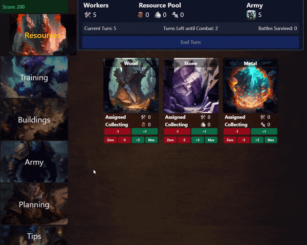

## 📷 Screenshots

  
Main Menu

    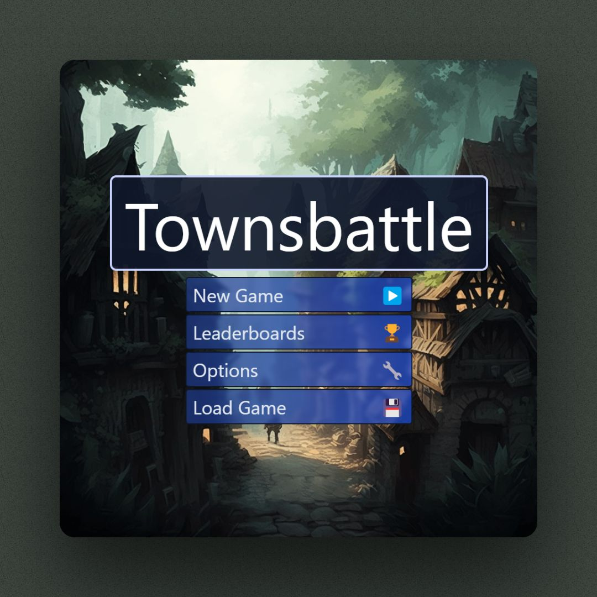

  
Planning

    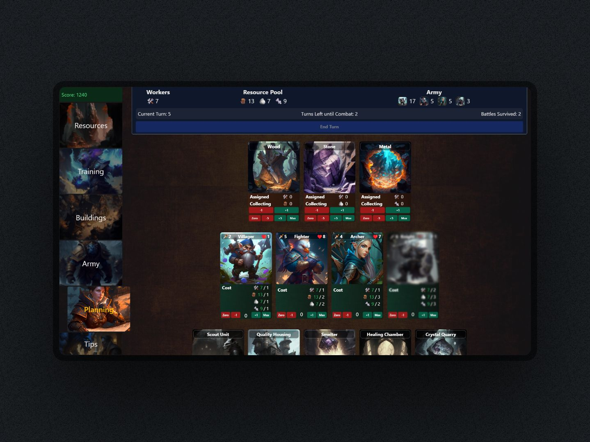
    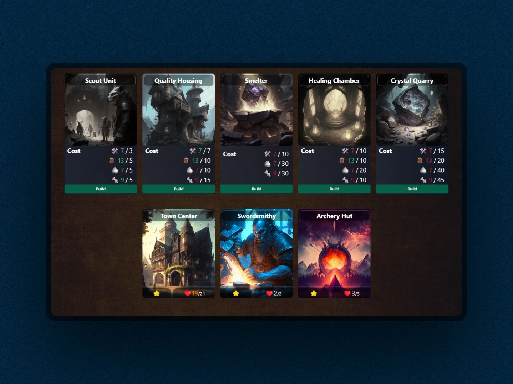
    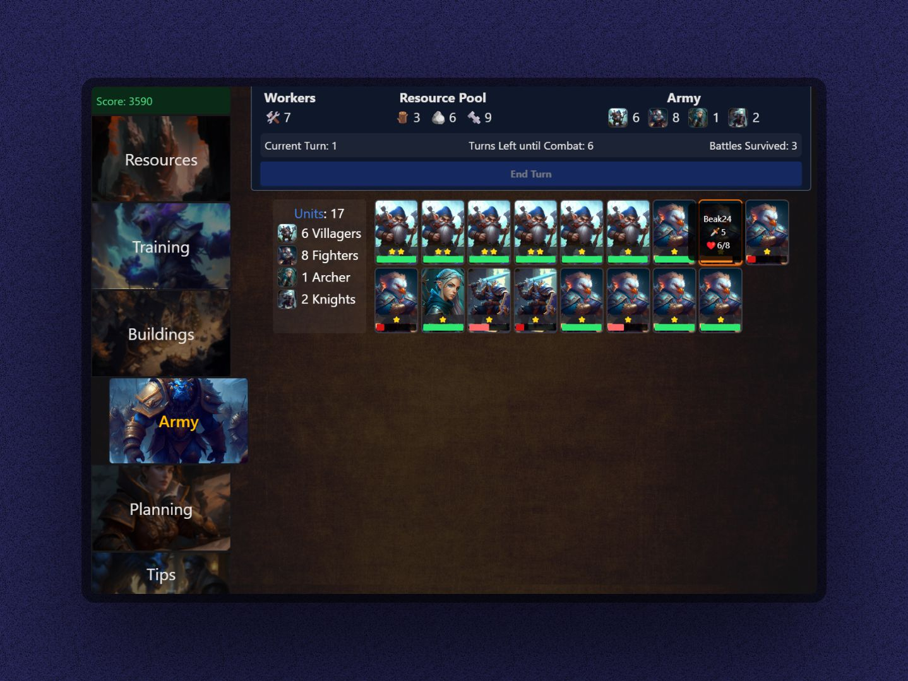

  
Combat

    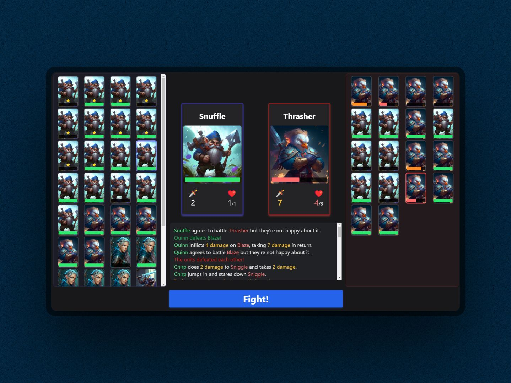
    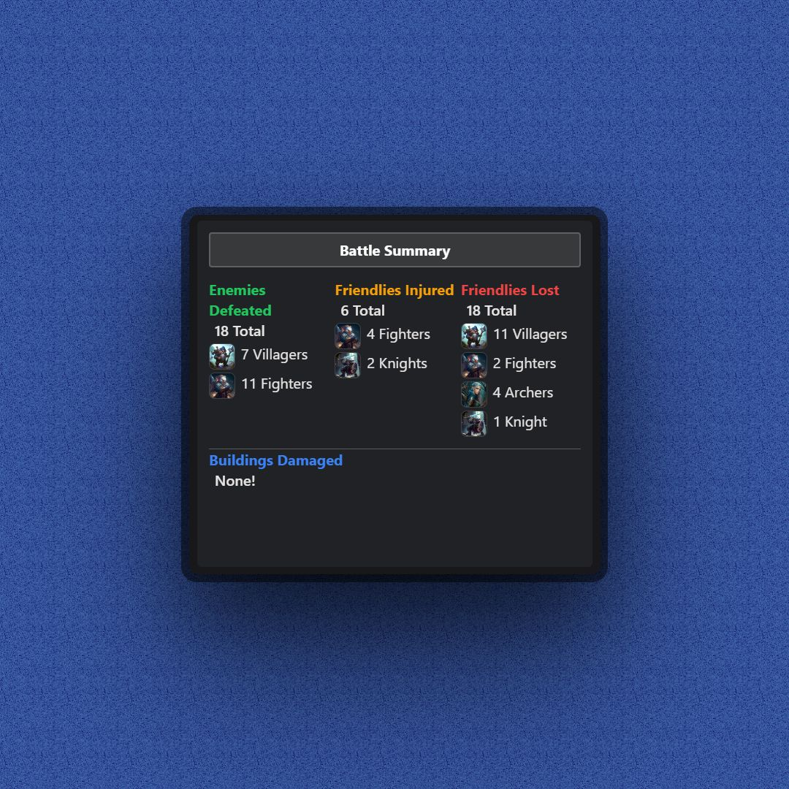

  
Mobile Friendly

    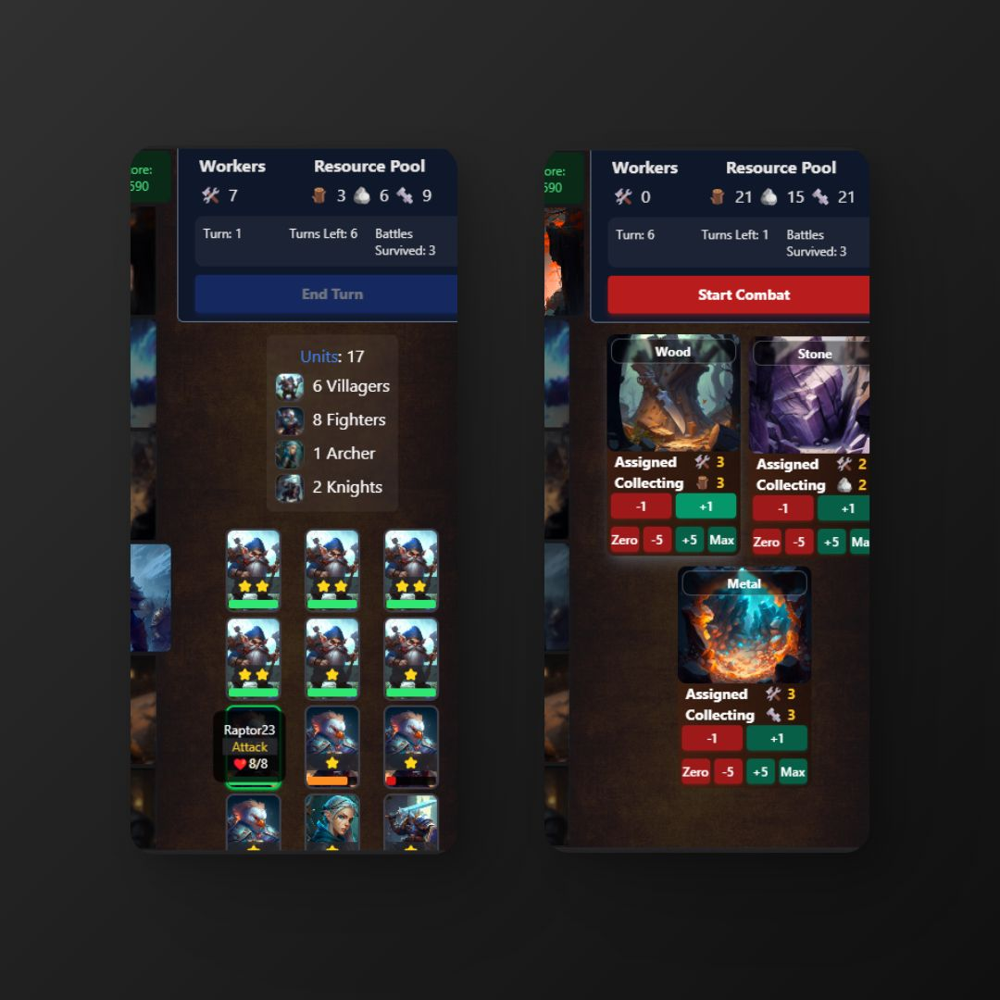
  

  
Card Art

    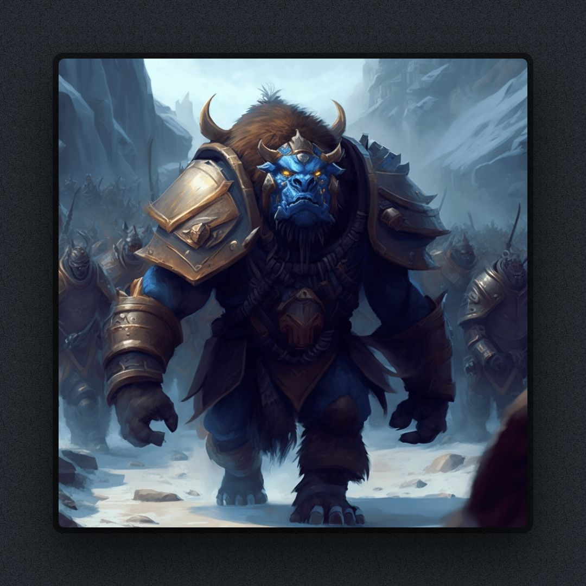
    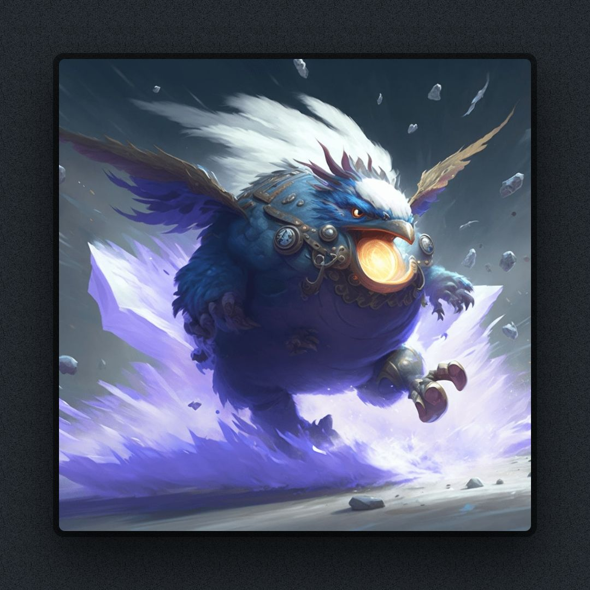
    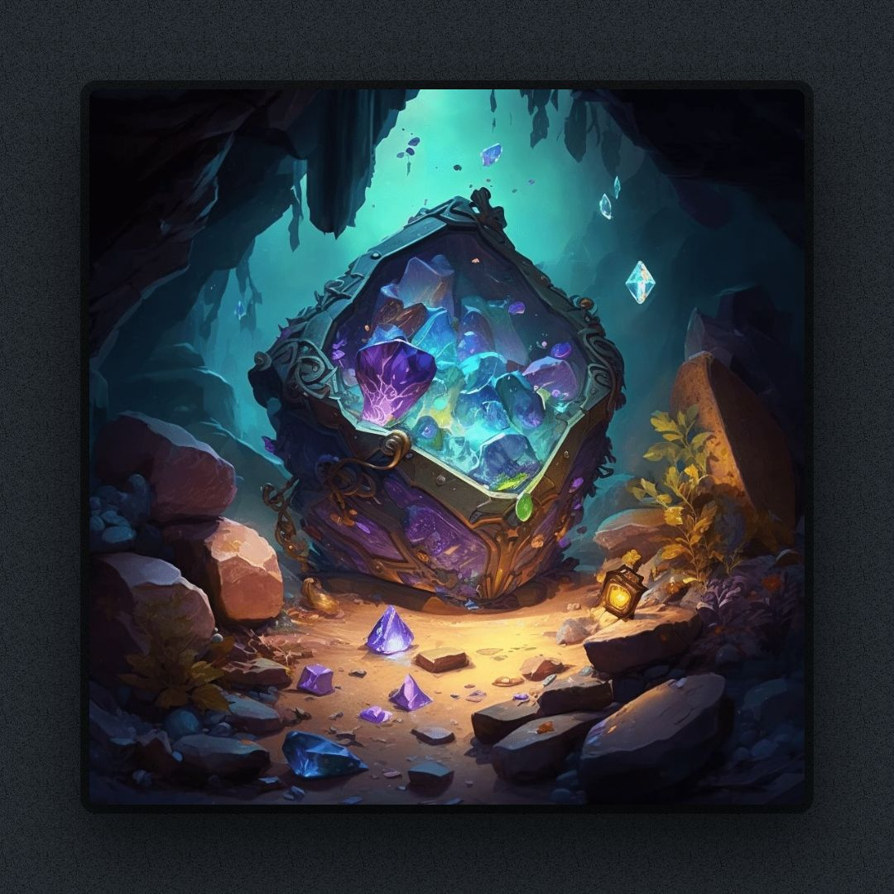

## 🕹️ How to Play

- "Townsbattle" is a turn-based strategy game in which you defend your town against waves of enemy attacks. The game has two main phases: "Planning" and "Combat."
- In "Planning," you assign workers to collect resources, which you can then use to train units and construct buildings.
- Each building you construct unlocks something new, such as new units or game-changing bonuses.
- In "Combat," you fight against increasingly tough waves of enemies with the army you have trained.
- Buildings have health and help protect your Town Center, which is your most important building. If it's destroyed, it's game over.
- Townsbattle was designed to be easy to play but challenging to master, with plenty of opportunities for strategic thinking and decision-making.

## 🖥️ Technologies Used

- React
- Tailwind CSS
- TypeScript
- [Node.js](https://nodejs.org/en) and [npm](https://www.npmjs.com/)
- [Coolors](https://coolors.co/)
- [Transform: CSS-to-Tailwind](https://transform.tools/css-to-tailwind)
- [Midjourney](https://discord.gg/midjourney)
- [ChatGPT](https://chat.openai.com/chat) - Great for understanding each line of code at a deeper level

## 🔮 Future Iterations

- Gameplay balancing
- More of everything! Resources, units, buildings and upgrades, and unique unit abilities
- Boss enemies
- Multiple game styles (e.g. Survival, Adventure)
- Better endgame content
- Roguelite mechanics
- More animations and sounds
- User authentication

## ✉️ Contact

- [Scott Skanes](https://www.linkedin.com/in/sskanes/) - [scottskanes@gmail.com](scottskanes@gmail.com)
- Project Link: https://github.com/skanes17/townsbattle

## 🙏🏻 Acknowledgements

- This game was created as part of the Get Coding program
- A massive thanks to my coach and friend Devin Marsh, who constantly pushed me to make something bigger, better, and more complicated 😂
- Hearthstone for providing inspiration for art and combat mechanics
- Gabby Burke, Michael Appleby, and my wife Allison Skanes for playtesting and providing critical feedback
- [MDN Web Docs](https://developer.mozilla.org/)
- Countless other websites and YouTube videos
